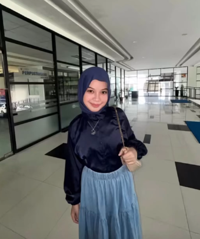

# Inda Novikepriani - Personal Portfolio ✨

 *(Ganti dengan screenshot website Anda jika sudah online)*

Sebuah website portofolio interaktif dan responsif yang dirancang dengan estetika modern bergaya **Glassmorphism** dan **Dark Mode**. Website ini dibangun untuk menampilkan profil, pengalaman kepanitiaan, serta rekam jejak organisasi dari **Inda Novikepriani**, seorang mahasiswa Teknik Komputer (Angkatan 2024) yang memiliki minat tinggi di bidang teknologi dan kepemimpinan.

## 🚀 Fitur Utama

- **Desain Modern (Glassmorphism & Dark Mode):** Antarmuka elegan bergaya futuristik yang memberikan kesan profesional, bersih, dan estetik.
- **Responsif Sepenuhnya:** Tampilan otomatis beradaptasi dengan sempurna baik di perangkat Desktop, Tablet, maupun *Mobile* (dilengkapi dengan *Hamburger Navigation Menu*).
- **Animasi Interaktif:** Terdapat efek *scroll-reveal* (fade-up, fade-left/right) dan transisi halus (efek hover) yang menghidupkan website setiap kali digulir ke bawah.
- **Manajemen Konten Fleksibel:** Menampilkan *timeline* riwayat organisasi dan kartu pengalaman dengan tombol *View More/Less* untuk menghemat ruang dan meningkatkan interaktivitas.
- **Tautan Kontak Langsung:** Terintegrasi langsung dengan profil Instagram dan WhatsApp untuk memudahkan perekrut atau koneksi profesional menghubungi.

## 🛠️ Teknologi yang Digunakan

Proyek ini murni dikembangkan menggunakan teknologi *frontend* tanpa *framework* yang berat, demi performa yang cepat dan modifikasi yang mudah:
- **HTML5:** Struktur semantik.
- **CSS3:** Styling (Flexbox/Grid), *Custom Variables*, efek animasi *Keyframes*, dan *Glassmorphism/Backdrop-filter*.
- **Vanilla JavaScript:** Logika interaksi antarmuka (DOM Manipulation), *Intersection Observer* untuk deteksi guliran (*scroll reveal*), dan pengaturan navigasi responsif.
- **FontAwesome:** Ikon sosial media dan antarmuka.

## 📂 Struktur Direktori

```text
├── index.html       # Halaman utama portofolio
├── style.css        # Seluruh styling dan animasi responsif
├── script.js        # Logika interaktif JavaScript
├── image/           # Aset gambar dan dokumentasi kegiatan
└── README.md        # Deskripsi dan dokumentasi proyek
```

## 👩‍💻 Tentang Pengembang

**Inda Novikepriani**
*Computer Engineering Student 2024 & Technology Enthusiast*

Berpengalaman aktif dalam kepanitiaan strategis dan manajemen acara seperti:
- **Wakil Ketua** Himpunan Mahasiswa Teknik Komputer (HIMATEK) 2025/2026.
- **Ketua Pelaksana** Cyber Craft Expo 2026.
- Tim intii acara dan kepanitiaan lainnya (HIMARITY, MAKRAB TK, IForte, IMC, dll).

Terus berupaya mengembangkan diri, berbagi pengetahuan, dan berkolaborasi dalam tim yang menjunjung tinggi pemecahan masalah (*solution-oriented*).

---

### 📥 Cara Menjalankan Proyek Secara Lokal

1. Lakukan *Clone* repositori ini:
   ```bash
   git clone https://github.com/username-anda/nama-repo.git
   ```
2. Buka folder proyek tersebut.
3. Klik ganda pada file `index.html` untuk membukanya secara langsung di peramban web (*browser*) Anda (Chrome, Edge, Safari, dll).
   *(Atau gunakan ekstensi Live Server di VSCode untuk pengalaman *development* yang lebih baik).*

> *"Building collaboration, sharing knowledge, and making an impact."* 🚀
"# PORTFOLIO-PEOPOLE-ORGANAIZER" 
"# PORTOFOLIO-PENGALAMAN-ORGANISASI" 
